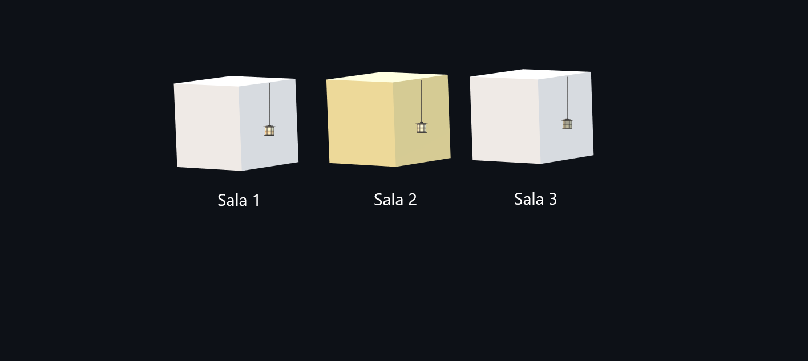

(5) Você está em uma sala com três interruptores, cada um conectado a uma lâmpada em salas diferentes. Você não pode ver as lâmpadas da sala em que está, mas pode ligar e desligar os interruptores quantas vezes quiser. Seu objetivo é descobrir qual interruptor controla qual lâmpada. Como você faria para descobrir, usando apenas duas idas até uma das salas das lâmpadas, qual interruptor controla cada lâmpada?

 

A ideia seria ligar o interruptor 1 durante um período de tempo para esquentar a lâmpada de uma das salas, depois desligar o interruptor 1 e depois ligar interruptor 2.

Com isso, a sala que estiver  com a lâmpada apagada e  quente pertence ao interruptor 1, a sala que estiver com lâmpada ligada pertence ao interruptor 2 e a sala que estiver com a lâmpada apagada e fria pertence ao interruptor 3.

Para uma melhor visualização, fiz um desenho no Paint para ilustrar

<h3>Exemplo</h3>

Entro na sala 1 vejo que a lâmpada está quente e apagada(interruptor 1), entro na sala 2 e vejo que a lâmpada está acesa(interruptor 2), logo a lâmpada da sala 3 pertence ao interruptor 3.

Com esse processo, é possível descobrir qual interruptor controla qual lâmpada  usando apenas duas idas até uma das salas das lâmpadas.

